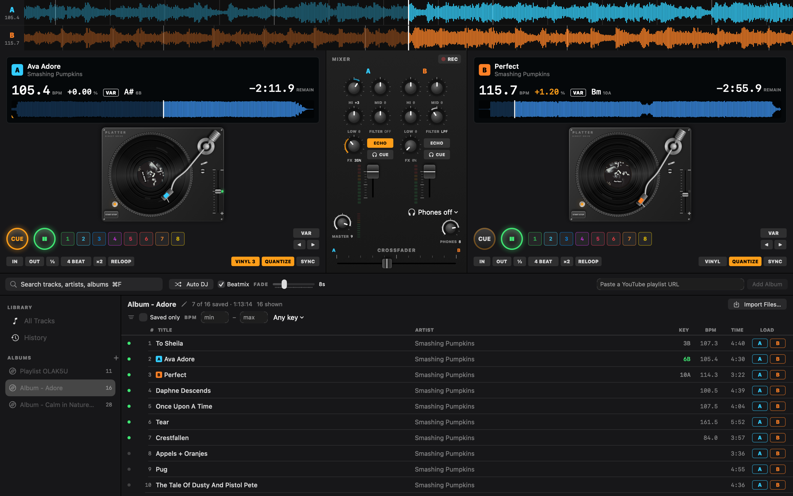

# Platter



A two-deck DJ rig for macOS, built in SwiftUI. Load YouTube playlists or your own audio
files, and mix on two turntables with a club mixer: beat grids, sync, loops, hot cues,
filters and effects, headphone cue, recording, and a beatmixing Auto DJ.

## Setup

Install `yt-dlp` and `ffmpeg` (needed for YouTube; local files work without them):

```sh
brew install yt-dlp ffmpeg
```

No cookies, login, or Keychain access. The app resolves **public** YouTube playlists
anonymously.

## Run

```sh
./run.sh
```

This builds (release), packages `./Platter.app`, and opens it with a Dock icon. Quit a
running copy first (⌘Q): when the app is already open, `open` only brings it to the front.

Tests (DSP, analysis, sync, mix planning, scratch, vinyl noise, parser, database, and the
audio graph rendered offline, with no sound):

```sh
swift test
PLATTER_NETWORK_TESTS=1 swift test                 # also the yt-dlp test against YouTube
PLATTER_TEST_TRACK=~/Music/song.m4a swift test     # also analyze a real track
```

Tests never read the app's own library or downloads.

CPU with both decks playing (starts a second, silent copy of the app for about 20 s; its
window comes to the front, because a hidden window is not drawn):

```sh
scripts/bench.sh
```

## How it works

- **Library.** A libSQL (Turso) database at
  `~/Library/Application Support/Platter/library.db`: albums, tracks, album order,
  downloads, analysis, saved cues, play history, smart albums, and settings. Search uses an
  FTS5 index on title and artist. The schema migrates in place (`PRAGMA user_version`).
- **Audio source.** YouTube playlists resolve with `yt-dlp --flat-playlist
  --dump-single-json`. Loading a track downloads it once to
  `~/Library/Application Support/Platter/cache/`. Imported files are copied there too.
- **Analysis** (once per track, stored): duration, waveform peaks (overview and 100/s
  detail), a beat grid, and the key. The grid comes from an onset envelope, autocorrelation
  for the tempo, and a least-squares fit of the beat times (tempo within 0.05 BPM and phase
  within 10 ms on test signals). The key comes from chroma and Krumhansl-Kessler profiles,
  shown in Camelot notation.
- **Engine.** One chain per deck:
  `player -> varispeed -> timePitch -> (+ scratch voice) -> EQ x3 -> filter -> echo -> reverb
  -> channel`, then `main -> peak limiter -> output`. Channel volume is level x crossfader
  gain (equal-power). A tap after the EQ feeds the meter and the headphone cue. The engine
  restarts when the output device changes.
- **Playback.** Each deck plays from its file on disk (`scheduleSegment`), so no decoded
  copy is held in memory and seeks are free. Loops queue copies of the loop ahead, so they
  are gapless. The playhead comes from the player's audio clock.
- **Headphones (PFL).** A second engine on the chosen device plays the cue feeds through a
  ring buffer kept near 2048 frames, so clock drift between devices cannot build up delay.

## Screen

Top: the close-up waveforms of both decks, with beat and bar lines, for lining up beats by
eye. Middle: turntable A, the mixer, turntable B. Bottom: the library (drag the divider to
resize).

- **Turntable:** the record turns at 33 1/3 RPM from the audio clock and follows pitch,
  pause, and seeks. The tonearm tracks the playhead across the grooves. Drag the record to
  scratch (one turn = 1.8 s): you hear it forward and backward, and a still hand is silent.
  Let go and it plays on.
- **Pitch fader** (Technics layout): minus at the top, ±8%, a click and a green lamp at 0.
  Double-click resets. `START·STOP` starts and stops the platter.
- **Pitch mode** (`VAR` / `KEY` / `BPM`): varispeed (tempo and pitch), key lock (tempo only),
  BPM shift (pitch only).
- **Display:** BPM at the current tempo, pitch %, mode, key and Camelot code, LOOP, and time
  (click it for remaining or elapsed). Click or drag the overview to jump.
- **CUE / PLAY**, **hot cues 1-8** (click an empty pad to store, a lit pad to jump,
  right-click to clear). The cue point and hot cues are saved per track.
- **Loops:** `IN` / `OUT`, `4 BEAT` (from the current beat; press again to exit), `½` and
  `×2`, `RELOOP`. **QUANTIZE** snaps cues and loops to the beat grid.
- **SYNC:** matches the tempo (also half and double time) and the beat phase to the other
  deck, then removes the last few milliseconds with a short bend. Needs a grid on both decks.
- **Bend** (`◀` `▶`): hold to slow down or speed up by 4%.
- **VINYL** (Off, 1, 2, 3): record surface noise. Crackle, pops, hiss, and rumble, plus
  groove damage that clicks once per turn (every 1.8 s at 33 1/3 RPM). The noise lives on
  the groove, so it stops with the platter, follows the pitch, and scratches with you. It
  also adds wow and flutter (±0.08% once per turn, ±0.03% at 6.3 Hz); both average to zero,
  so a sync does not drift.
- **Mixer:** per channel HI/MID/LOW (click at 0 dB), FILTER (left low-pass, right
  high-pass), FX amount with ECHO (half a beat) or REVERB, CUE for the headphones, and the
  channel fader with a meter. Then MASTER with its meter, the headphone device and level,
  `REC` (records the master to `~/Music/Platter`), and the crossfader. Double-click a knob
  or the crossfader to reset it.
- **Library:** sources in the sidebar: All Tracks, History, smart albums, albums. `⌘F`
  searches everything. The filter bar has saved only, a BPM range, and "key mixes with deck
  A/B"; save it as a smart album. Click a column to sort. The KEY column is green when the
  track mixes with the playing deck. Paste a playlist URL to add an album, or use
  `Import Files…` or drop audio files (mp3, m4a, wav, aiff, flac, caf) on the list.
  Right-click albums and tracks for rename, edit, move, download, and delete. Double-click a
  track to load it onto the free deck.
- **Auto DJ** (library toolbar): plays the list on alternate decks. With **Beatmix** it
  starts each mix on a 16-beat phrase, brings the next track in on its cue point or first
  beat, syncs it in key lock, swaps the basses halfway, and lets the tempo glide back to the
  track's own. Without Beatmix it crossfades over the last `FADE` seconds.

## Keyboard

Keys work when no text field has focus.

| | Deck A | Deck B |
|---|---|---|
| CUE | `Z` | `N` |
| PLAY / PAUSE | `X` | `M` |
| SYNC | `C` | `,` |
| Beat loop on / off | `Q` | `P` |
| Hot cues 1-4 | `1` `2` `3` `4` | `7` `8` `9` `0` |
| Bend − / + (hold) | `A` / `S` | `K` / `L` |

Crossfader: `[` toward A, `]` toward B, `\` center. Search: `⌘F`.

## YouTube

The app calls `yt-dlp` to resolve and download public YouTube audio for personal use.
Downloading may break YouTube's Terms of Service, and the tracks are protected by the rights
of their owners. You are responsible for what you download and play. Local files are the
safe choice for anything public.

## Limits

- **Public playlists only.** Algorithmic "radio" playlists (`RDCLAK...`) and
  private/premium tracks do not resolve anonymously.
- The beat grid assumes a constant tempo. It fits electronic music well; live recordings
  with tempo drift get an average grid.
- Importing the same file twice adds it twice.
- No MIDI controllers.
- Turso cloud sync is not on. The database is a local file; the libSQL package supports
  embedded replicas when that is wanted.

## License

MIT, see [LICENSE](LICENSE). Platter is not affiliated with Pioneer DJ, AlphaTheta, or
Technics; product names mentioned are the trademarks of their owners.
